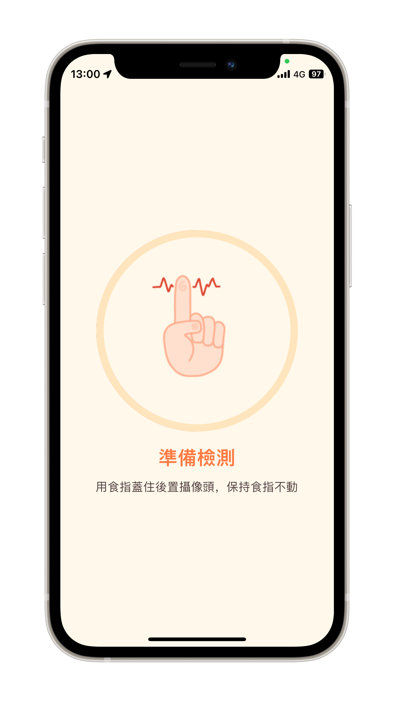
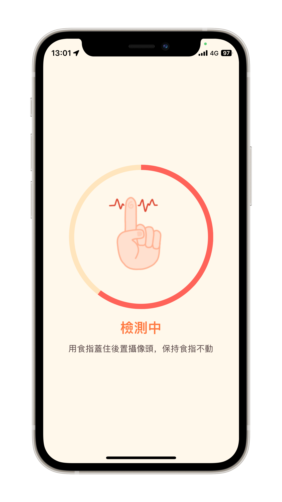
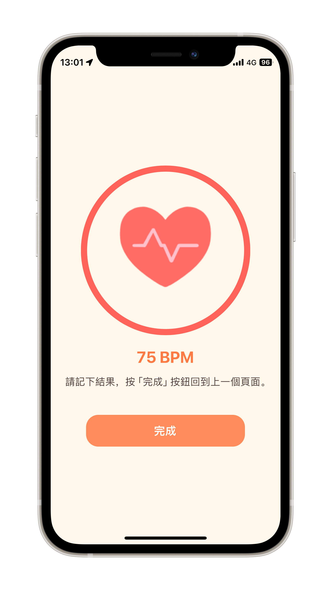

# React Native Heart Rate Monitor

<br />
<p align="center">

</p>

Heart Rate Monitor（心率監測）App written in React Native.

## Getting Started

Run the following code to install the necessary frameworks and components
    
```bash
yarn install
```

### Environment Setup

Please refer to the React Native [official page](https://reactnative.dev/docs/environment-setup#node--watchman) to complete the running environment configuration.

### Android Setup

When you complete the running environment configuration, run the following code to run the project on a simulator or an physical device.

```bash
yarn android
```

or

```bash
npx react-native run-android
```

### iOS Setup


#### Simulator

Open a new terminal inside your React Native project folder. Run the following command:

```bash
yarn ios 
```

or

```bash
npx react-native run-ios
```

#### Device

1. [Plug in your device via USB](https://reactnative.dev/docs/running-on-device#1-plug-in-your-device-via-usb)

2. [Configure code signing](https://reactnative.dev/docs/running-on-device#2-configure-code-signing)

    > Register for an [Apple developer account](https://developer.apple.com/) if you don't have one yet.

    > Select your project in the Xcode Project Navigator, then select your main target (it should share the same name as your project). Look for the "General" tab. Go to "Signing" and make sure your Apple developer account or team is selected under the Team dropdown. Do the same for the tests target (it ends with Tests, and is below your main target).

3. [Build and Run your app](https://reactnative.dev/docs/running-on-device#3-build-and-run-your-app)


## Screenshots
       

## TODO
- [ ] Improve algorithm accuracy
- [ ] Add i18n support
- [ ] Add a heart rate history page
- [ ] Add a heart rate chart

## Special thanks to
- [Measuring Your Heart Rate Using Your Phone’s Camera and Flutter
](https://betterprogramming.pub/measuring-your-heart-rate-using-your-phones-camera-and-flutter-f444d3c4272a)
- [thanospapazoglou/Pulse: ❤️ A heart rate camera pulse detector written in Swift.](https://github.com/thanospapazoglou/Pulse)

## License
[MIT](https://choosealicense.com/licenses/mit/)